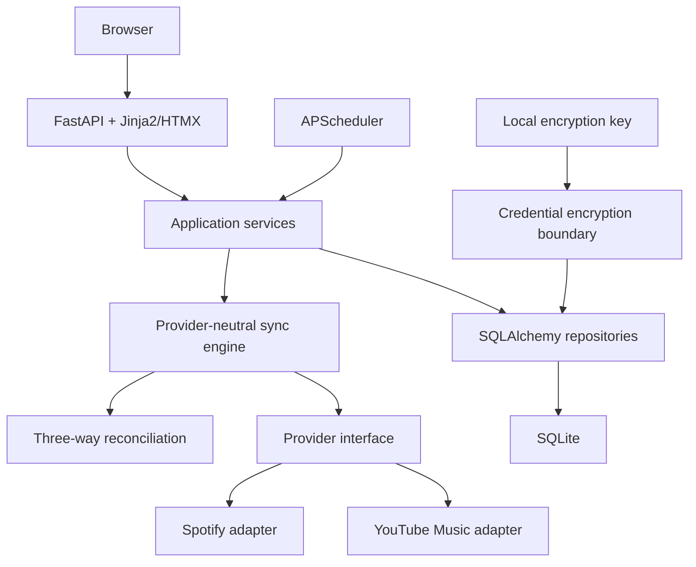

# Open Playlist Sync implementation architecture

## Scope

OPS is a self-hosted service that will keep playlists synchronized in both
directions between supported music providers. The first providers are Spotify
and YouTube Music. The design prioritizes local control, recoverability, and
safe behavior when the two providers disagree.

This document describes the implementation boundary for the runnable
operator-assisted milestone. Provider authentication is initiated from the
local UI, while synchronization remains reviewable and safety-gated.

The [technical completion guide](technical-completion-guide.md) records the
audited gaps, implementation sequence, release tests, and production definition
of done for the work beyond this milestone.

## Goals and non-goals

### Goals

1. Keep synchronization policy independent of provider SDKs and HTTP details.
2. Persist enough state to explain, retry, and safely reconcile a synchronization
   run.
3. Make the first synchronization non-destructive and make all later deletes
   explicit, reviewable, and guarded.
4. Run on a normal Python host, Docker, or TrueNAS SCALE without TrueNAS APIs.
5. Keep credentials local, encrypted at rest, and absent from logs and source.
6. Make provider behavior replaceable with fakes in tests.

### Remaining non-goals for this milestone

- Running unattended synchronization without operator approval.
- Guaranteeing provider API behavior before live-account verification.
- Adding telemetry, hosted services, or a cloud control plane.

## Component boundaries



### `src/ops/api/`

HTTP routes, request/response schemas, and dependency wiring. The API layer
must not contain provider-specific reconciliation rules.

The `/settings` route is the operator configuration boundary. It never renders
saved client secrets and persists submitted values through the encrypted
configuration repository.

### `src/ops/configuration.py`

This service overlays encrypted GUI settings on deployment defaults. Provider
OAuth values and scheduler preferences take effect on the next request; the
scheduler is reconfigured immediately after a settings save.

### `src/ops/providers/`

The common provider contract and provider adapters. An adapter translates
provider-specific playlist and track representations into the neutral domain
types. HTTP clients and authentication details stay here. The adapter boundary
must accept injected clients or transport fakes.

The current milestone contains operator-assisted authentication boundaries,
read operations, and write operations for Spotify and YouTube Music. Writes are
only reachable through the safety executor, which preflights the complete plan,
rejects conflicts and stale fingerprints, and requires an explicit phrase for
destructive actions.

Snapshots preserve playlist occurrences rather than collapsing duplicate songs.
Spotify positions and YouTube Music `setVideoId` values remain attached to an
occurrence so a reviewed removal can target one exact provider item. Initial
synchronization has an explicit persisted policy: merge, source-led,
target-led, or accept-as-is. The first three modes add only; no initial policy
can infer a deletion.

### `src/ops/sync/`

The provider-neutral orchestration boundary. It will load a previous successful
baseline, obtain current snapshots from both provider adapters, create a
reconciliation plan, apply only approved changes, and record a new baseline
after a successful run. It must not make irreversible provider calls while
constructing a plan.

### `src/ops/db.py`, `src/ops/models.py`, and `src/ops/storage/`

The current scaffold keeps the SQLAlchemy base, engine, and initial models in
`db.py` and `models.py`; the `storage/` package is reserved for repositories.
Those boundaries are backed by SQLite. Alembic is the only schema-change
mechanism. The database path is configuration-driven so the same code works
with a local file or a Docker volume.

`app_configuration` stores the operator-entered provider client settings and
scheduler preferences as Fernet ciphertext. Deployment defaults can still come
from environment variables, but values saved through `/settings` take
precedence without requiring a shell or container rebuild.

### Templates and static assets

The UI will be server-rendered with Jinja2. HTMX should be used for focused
partial updates rather than introducing a separate frontend build system.
The current UI provides provider connection entry points, pair configuration,
encrypted settings management, run history, and a synchronization-plan review
screen. Applying a plan first
re-fetches both provider playlists and rejects stale fingerprints.
It also includes a local synthetic provider pair so the complete baseline,
preview, approval, and application flow can be tested without network access.

## Provider-neutral contract

The common provider interface should expose operations in terms of neutral
playlist and track types:

- list playlists;
- read a playlist snapshot;
- create a playlist;
- add tracks;
- remove tracks;
- rename or update playlist metadata.

Provider IDs remain opaque strings. The synchronization engine must never infer
that a Spotify ID and a YouTube Music ID are interchangeable. Track matching
needs a normalized identity with an explicit confidence policy; unresolved
matches must be surfaced for review instead of silently discarded.

## Three-way reconciliation model

Each synchronization pair has a previous successful baseline `B`, a current
source snapshot `S`, and a current target snapshot `T`:

```text
change on source = S - B
change on target = T - B
```

The engine combines those changes into a plan:

- a change on one side only can be proposed for the other side;
- the same change on both sides is already converged;
- incompatible changes are conflicts and require an explicit policy or user
  decision;
- a deletion is never inferred as safe solely because an item is absent from a
  fresh provider response;
- the initial run has no trusted baseline, so it must produce a non-destructive
  preview/import plan.

The baseline is advanced only after all selected operations succeed and the
resulting snapshots are persisted. Failed or partially applied runs must remain
visible and must not become the next baseline.

The execution path records a `sync_run` and one `sync_action` entry per provider
operation before the first write. An action is marked complete immediately after
its provider call. A failed action leaves the run and its completed predecessors
visible for review; OPS never advances the baseline for that run.

## Persistence direction

The initial migration establishes these conceptual records:

- `app_configuration`: encrypted operator settings and scheduler preferences;
- `provider_accounts`: provider identity plus encrypted credential ciphertext;
- `sync_pairs`: the two provider accounts and playlist IDs being synchronized;
- `sync_baselines`: the last successful normalized snapshot for a pair and
  playlist;
- `sync_runs`: status, timestamps, and a diagnostic summary for each attempt.

The JSON snapshot columns are intentionally a staging choice. Before the first
production release, evaluate whether large playlists need normalized child
tables, content hashes, or compression. Any migration must preserve the ability
to reconstruct the previous successful baseline.

## Security and privacy

- Deployment configuration is read from environment variables or an optional
  local `.env` file that is ignored by Git. Operator settings are entered from
  the GUI and stored encrypted in SQLite.
- No credential values are present in source, tests, logs, URLs, or exception
  messages.
- The credential service encrypts provider tokens before SQLAlchemy persistence
  and decrypts only inside the provider adapter boundary.
- If deployment does not provide secrets, OPS generates a session secret and a
  Fernet key in the persistent data directory on first start. The key is kept
  outside the database so database ciphertext cannot decrypt itself.
- The service has no telemetry endpoint, analytics dependency, or outbound
  call except provider operations initiated by the operator.
- Destructive operations need a dry-run plan, explicit confirmation, and a
  second check that the target version still matches the planned version.

## Deployment

Docker is the primary packaging target. The container runs as a non-root user,
stores SQLite data on `/data`, and exposes only the FastAPI HTTP port. Compose
provides a portable local and TrueNAS SCALE deployment shape using a named
volume. No TrueNAS-specific code is required or imported.

## Testing strategy

- Unit tests will exercise reconciliation with synthetic provider snapshots.
- Provider adapters will be tested against injected HTTP/client fakes, never
  live accounts.
- Persistence tests will use temporary SQLite databases.
- API tests will use FastAPI's test client and an isolated settings/database
  dependency.
- CI will run formatting, linting, and the full test suite on Python 3.12.
- The container image is built in a separate CI job.

## Decisions requiring future attention

1. **Credential key rotation and recovery:** Fernet authenticated encryption is
   implemented for the current milestone; define key rotation, recovery, and
   behavior when the key is unavailable.
2. **OAuth callback and session model:** decide how a self-hosted instance
   safely handles callback URLs, browser sessions, token refresh, and optional
   remote access without exposing secrets in logs.
3. **Track identity and matching policy:** define exact-match fields, fuzzy
   matching thresholds, manual resolution, and behavior for unavailable tracks.
4. **Conflict policy:** decide whether conflicts pause a run, create a review
   queue, or allow a per-playlist preference.
5. **Destructive-action confirmation:** define the operator UI, expiry window,
   version check, and audit record for approved deletions.
6. **Baseline storage scale:** validate JSON snapshots with realistic playlist
   sizes before committing to normalized tables or a hybrid schema.
7. **Scheduler behavior:** the lifecycle and single-instance preview tick are
   implemented; define durable job state, retries, backoff, and recovery after
   process restarts.
8. **TrueNAS packaging:** validate permissions, volume ownership, updates, and
   health-check behavior on a real SCALE host without adding platform coupling.
